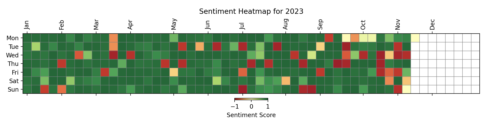

# Notion Sentiment Analyzer

This project connects to Notion using Notion API, retrieves entries from the database defined in `.env`, performs sentiment (happiness) analysis for each entry, and creates a diagram of sentiment over time, using `NOTION_DATE_FIELD` field.

## Installation

Before running the project, you need to install the required Python libraries. You can do this by running the following command:

```bash
pip install -r requirements.txt
```

## Setup

### Get Notion API Token

- Create a new integration [in your Notion account](https://www.notion.so/my-integrations).
- Give your integration a name and select the workspace you want to use it in.
- Once your integration is created, you will be given a `secret` value. This is your `NOTION_TOKEN`.
- Copy this value to `NOTION_TOKEN` environment variable in `.env` file.

### Get Notion Database ID

- Open the database in Notion and click the "Share" button in the top-right corner.
- In the "Invite people" dialog that appears, click the "Copy link" button to copy the URL to your clipboard.
- Paste the URL into your web browser and navigate to the database.
- The `NOTION_DATABASE_ID` is the string of characters that appears in the URL after `https://www.notion.so/`
- Add `REDIS_*` ENVs for caching.

### Get OpenAI API Key

- If you're using "gpt4" analyzer type, add `OPENAI_API_KEY` to .`env` file.

## Usage (Docker Compose)

By default, Docker runs the analyzer with NLTK model. To change that, update `docker-compose.yml` file.

```bash
docker-compose up
```

## Usage (local)

```bash
python analyzer.py
```

```bash
python analyzer.py -m gpt4
```

## Result

The resulting heatmap is in `output/` folder.



## Contributing

Pull requests are welcome. For major changes, please open an issue first to discuss what you would like to change.

## License

[MIT](https://choosealicense.com/licenses/mit/)
